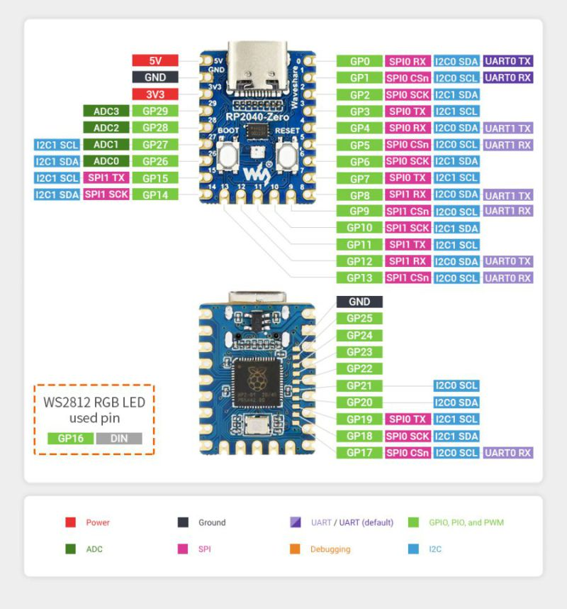
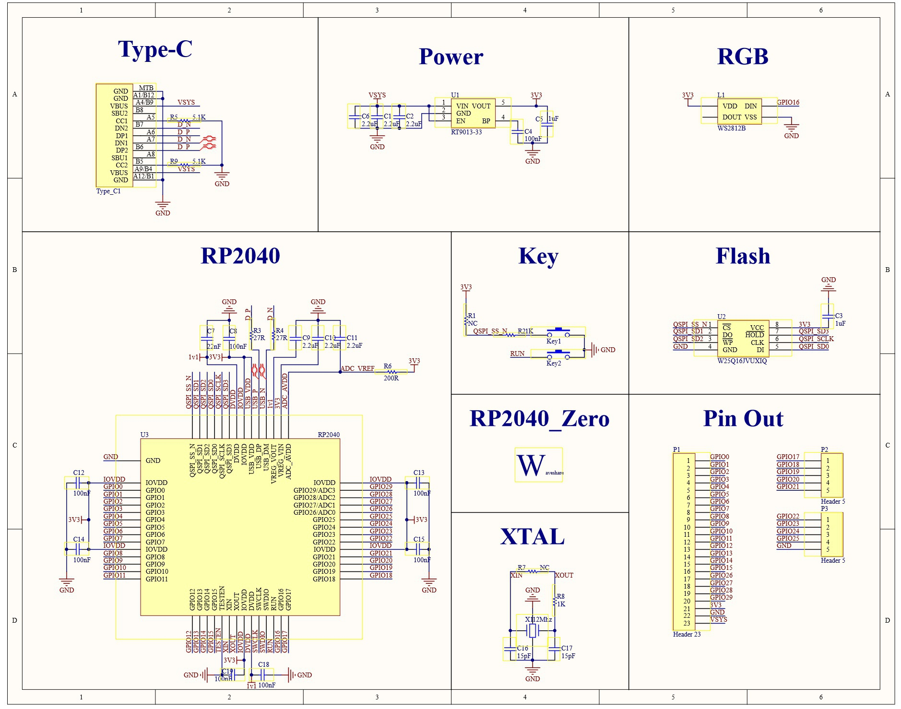

<h3>02 — Conception Hardware & PCB</h3>

> **Retour à l'index :** [Documentation](./README.md)

---

<h4>Table des matières</h4>

- [Le choix d'un microcontrôleur pour la conception d'un clavier USB HID custom](#le-choix-dun-microcontrôleur-pour-la-conception-dun-clavier-usb-hid-custom)
  - [Tableau Comparatif Exhaustif des Puces MCU pour Claviers USB HID](#tableau-comparatif-exhaustif-des-puces-mcu-pour-claviers-usb-hid)
  - [Analyse et Découpage par Typologie de Projet](#analyse-et-découpage-par-typologie-de-projet)
  - [Pourquoi le RP2040 ?](#pourquoi-le-rp2040-)
    - [Caractéristiques techniques et Ressources pour la carte RP2040-Zero](#caractéristiques-techniques-et-ressources-pour-la-carte-rp2040-zero)
    - [Pinout et schématique de la carte RP2040-Zero](#pinout-et-schématique-de-la-carte-rp2040-zero)
    - [Options de programmation](#options-de-programmation)
- [Matrice de touches](#matrice-de-touches)
  - [Principe de la matrice](#principe-de-la-matrice)
  - [Dimensions de la matrice](#dimensions-de-la-matrice)
  - [Diodes Anti-Ghosting](#diodes-anti-ghosting)
  - [Pourquoi pas de GPIO directs sur le RP2040 ?](#pourquoi-pas-de-gpio-directs-sur-le-rp2040-)
- [Switches Cherry MX2A](#switches-cherry-mx2a)
  - [Version V1 — Brown (Tactile)](#version-v1--brown-tactile)
  - [Version V2 — Blue (Clicky)](#version-v2--blue-clicky)
  - [Sockets Hotswap](#sockets-hotswap)
- [Assignation finale des broches GPIO](#assignation-finale-des-broches-gpio)
  - [Bilan GPIO](#bilan-gpio)
- [Architecture hardware globale](#architecture-hardware-globale)
- [Nomenclature BOM](#nomenclature-bom)
- [Outils de conception PCB](#outils-de-conception-pcb)
  - [KiCad](#kicad)
  - [Ergogen (Layout PCB automatisé)](#ergogen-layout-pcb-automatisé)

---

## Le choix d'un microcontrôleur pour la conception d'un clavier USB HID custom

Ce tableau panoramique regroupe l'ensemble des puces du marché, des solutions historiques aux processeurs modernes (ARM, RISC-V, 8051), classées par familles d'architecture pour vous donner une vision globale et le bon niveau de décision technique pour le projet **Open-TPMX2030**.

### Tableau Comparatif Exhaustif des Puces MCU pour Claviers USB HID

| Modèle MCU           | Architecture / Cœur            | Fréquence  | Flash / RAM            | GPIO (approx.) | Type USB                 | Sans-Fil             | Support Firmware                   | Cas d'Usage / Remarques                                               |
| -------------------- | ------------------------------ | ---------- | ---------------------- | -------------- | ------------------------ | -------------------- | ---------------------------------- | --------------------------------------------------------------------- |
| **ATmega32U4**       | 8-bit AVR                      | 16 MHz     | 32 KB / 2.5 KB         | 18 - 26        | **Natif (FS)**           | Non                  | QMK, VIA, TMK, Arduino             | Standard historique (Pro Micro). Flash très limitée.                  |
| **AT90USB1286**      | 8-bit AVR                      | 16 MHz     | 128 KB / 8 KB          | 46             | **Natif (FS)**           | Non                  | QMK, TMK, Arduino                  | Ancien standard grand format (Teensy 2.0++).                          |
| **ATmega32A**        | 8-bit AVR                      | 16 MHz     | 32 KB / 2 KB           | 32             | **Emulé (V-USB)**        | Non                  | QMK, TMK                           | Émulation USB logicielle (ex: GH60). Obsolète.                        |
| **ATtiny85**         | 8-bit AVR                      | 16 MHz     | 8 KB / 512 B           | 6              | **Emulé (V-USB)**        | Non                  | Micronucleus, Arduino              | Ultra-limité (Digispark). Idéal pour macropads 2-4 touches.           |
| **RP2040**           | 32-bit ARM Cortex-M0+          | 133 MHz    | 2 à 16 MB / 264 KB     | 20 à 30        | **Natif (FS)**           | Non                  | QMK, KMK, Vial, Arduino            | **Le nouveau standard filaire (Incontournable).**                     |
| **RP2350**           | 32-bit ARM Cortex-M33 / RISC-V | 150 MHz    | 4 à 16 MB / 520 KB     | 30 à 48        | **Natif (FS)**           | Non                  | Pico-SDK, CircuitPython, Arduino   | Successeur du RP2040. Sécurité renforcée & plus d'E/S.                |
| **STM32F103**        | 32-bit ARM Cortex-M3           | 72 MHz     | 64-128 KB / 20 KB      | ~37            | **Natif (FS)**           | Non                  | QMK, VIA, Arduino                  | Puce "Blue Pill". Écosystème très mature mais contrefaçons.           |
| **STM32F401 / F411** | 32-bit ARM Cortex-M4           | 84-100 MHz | 256-512 KB / 64-128 KB | ~32            | **Natif (FS/HS)**        | Non                  | QMK, Vial, Arduino                 | Puce "Black Pill". Excellentes performances / prix.                   |
| **STM32L432**        | 32-bit ARM Cortex-M4           | 80 MHz     | 256 KB / 64 KB         | ~20            | **Natif (Crystal-less)** | Non                  | QMK, Custom                        | Très faible consommation. Idéal sur PCB très compacts.                |
| **ATSAMD21G18**      | 32-bit ARM Cortex-M0+          | 48 MHz     | 256 KB / 32 KB         | ~26            | **Natif (FS)**           | Non                  | QMK, CircuitPython, Arduino        | Répandu (Seeeduino Xiao, Arduino Zero).                               |
| **ATSAMD51**         | 32-bit ARM Cortex-M4F          | 120 MHz    | 512 KB / 192 KB        | ~38            | **Natif (FS/HS)**        | Non                  | QMK, CircuitPython                 | Haute performance, gestion d'écrans complexes/RGB.                    |
| **nRF52840**         | 32-bit ARM Cortex-M4F          | 64 MHz     | 1 MB / 256 KB          | 21 à 48        | **Natif (FS)**           | **BLE 5.0 / Thread** | ZMK, Bluemicro, Arduino            | **Le Roi du Sans-Fil (nice!nano, Xiao BLE).**                         |
| **nRF52833**         | 32-bit ARM Cortex-M4F          | 64 MHz     | 512 KB / 128 KB        | ~18            | **Natif (FS)**           | **BLE 5.0**          | ZMK, Arduino                       | Variante économique du nRF52840 (moins de RAM/Flash).                 |
| **ESP32-S2**         | 32-bit Xtensa Single-Core      | 240 MHz    | 4 MB / 320 KB          | ~43            | **Natif (OTG FS)**       | **Wi-Fi**            | CircuitPython, Arduino             | Wi-Fi + USB Natif. Consommation élevée.                               |
| **ESP32-S3**         | 32-bit Xtensa Dual-Core        | 240 MHz    | 4 à 16 MB / 512 KB     | ~45            | **Natif (OTG FS)**       | **Wi-Fi + BLE 5**    | CircuitPython, QMK (port), Arduino | Très puissant, gère le BLE et l'USB HID simultanément.                |
| **Teensy 3.2**       | 32-bit ARM Cortex-M4           | 72 MHz     | 256 KB / 64 KB         | 34             | **Natif (FS)**           | Non                  | QMK, Arduino                       | Référence historique haut de gamme (MK20DX256).                       |
| **Teensy 4.0 / 4.1** | 32-bit ARM Cortex-M7           | 600 MHz    | 2 MB / 1 MB            | 31 à 55        | **Natif (HS 480Mbps)**   | Non                  | QMK, Arduino                       | Puissance brute / Station de laboratoire / Traitement Audio.          |
| **CH552 / CH554**    | 8-bit Enhanced 8051            | 24 MHz     | 16 KB / 1.2 KB         | ~17            | **Natif (FS)**           | Non                  | Custom C, Arduino                  | **Puce à < 0,30 $.** Idéal pour macropads et claviers ultra-low-cost. |
| **CH32V203**         | 32-bit RISC-V                  | 144 MHz    | 64 KB / 20 KB          | ~37            | **Natif (FS)**           | Non                  | OpenWCH, Custom                    | Alternative RISC-V ultra économique au STM32.                         |

---

### Analyse et Découpage par Typologie de Projet

Pour vous guider dans vos choix d'ingénierie, l'ensemble de ces puces se divise en 4 grandes catégories :

1. Les Puces Légendaires en Fin de Vie (8-bit / V-USB)

* **Puces :** `ATmega32U4`, `ATmega32A`, `ATtiny85`.
* **Constat :** Historiquement associées à l'essor du logiciel libre **QMK**, ces puces souffrent de leur faible quantité de mémoire Flash (32 Ko max). Aujourd'hui, activer le rétroéclairage RGB, les fonctionnalités de disposition complexe (comme *Vial*) ou le support des encodeurs rotatifs nécessite de sacrifier d'autres fonctions par manque de place.
* **Verdict :** À réserver uniquement au dépannage ou à la maintenance de puces existantes.

2. Les Standards Modernes pour Claviers Filaires (32-bit)

* **Puces :** `RP2040`, `RP2350`, `STM32F411`, `CH32V203`.
* **Constat :** Le **RP2040** est devenu le leader incontesté pour les cartes filaires grâce à son prix ridicule, sa mémoire flash externe quasi-illimitée (2 à 16 Mo) et son architecture USB ultra-fiable. Le **CH32V203** (RISC-V) et le **CH552** émergent sur le marché asiatique pour les claviers produits en masse à coût minimal.
* **Verdict :** Le **RP2040** (utilisé sur le RP2040-Zero du projet *Open-TPMX2030*) offre le meilleur rapport flexibilité/documentation/coût.

3. Les Références du Sans-Fil (Bluetooth / BLE)

* **Puces :** `nRF52840`, `ESP32-S3`.
* **Constat :** Le **nRF52840** règne en maître sur l'écosystème **ZMK**. Son architecture ultra-basse consommation permet à un clavier mécanique de fonctionner pendant plusieurs mois sur une simple batterie LiPo de 300 mAh. L'**ESP32-S3** est une alternative très puissante, mais sa consommation d'énergie élevée le réserve aux claviers filaires possédant un mode secours sans-fil.
* **Verdict :** Le **nRF52840** (via un footprint *nice!nano*) est le choix numéro 1 pour toute déclinaison sans-fil.

4. Les Monstres de Puissance (Prototypage & IHM Avancées)

* **Puces :** `Teensy 4.0/4.1`, `ATSAMD51`.
* **Constat :** Avec des fréquences dépassant les 100 à 600 MHz, ces cartes sont capables d'exécuter des traitements lourds en parallèle du protocole USB (ex: génération de son synthétisé, gestion d'écrans tactiles high-refresh-rate, traitement du signal vidéo).
* **Verdict :** Surdimensionné pour un clavier classique, mais très pertinent pour des postes de travail intégrant des consoles de mixage ou des contrôleurs dédiés à l'IHM.

### Pourquoi le RP2040 ?

Le **RP2040** de Raspberry Pi a été retenu comme cœur du projet pour les raisons suivantes :

- **Dual-core ARM Cortex-M0+** cadencé à 133 MHz — puissance largement suffisante pour la gestion d'un clavier complexe.
- **Support natif USB HID** : pas de circuit USB externe requis, le RP2040 gère lui-même le protocole USB Full Speed.
- **Écosystème open source vaste** : SDK C/C++, MicroPython, CircuitPython, Arduino-Pico.
- **Faible coût** (~3-5 € l'unité en lot).
- **Format castellated** du RP2040-Zero : permet de souder directement la carte sur le PCB principal.

#### Caractéristiques techniques et Ressources pour la carte RP2040-Zero

| Caractéristique      | Valeur                                               |
| -------------------- | ---------------------------------------------------- |
| **Processeur**       | ARM Cortex-M0+ dual-core @ 133 MHz                   |
| **SRAM**             | 264 Ko                                               |
| **Mémoire Flash**    | 2 Mo (W25Q16 SOIC-8)                                 |
| **GPIO accessibles** | 20 broches (GP0–GP15, GP26–GP29)                     |
| **Connectique**      | USB-C                                                |
| **Spécificité**      | Format ultra-compact, castellated (soudable sur PCB) |
| **LED RGB intégrée** | WS2812B sur GPIO 16                                  |

**Ressources :**

- 📄 [Datasheet RP2040](https://pip-assets.raspberrypi.com/categories/814-rp2040/documents/RP-008371-DS-1-rp2040-datasheet.pdf)
- 📄 [Hardware Design with RP2040](https://pip-assets.raspberrypi.com/categories/814-rp2040/documents/RP-008279-DS-1-hardware-design-with-rp2040.pdf)
- 🌐 [Wiki Waveshare RP2040-Zero](https://www.waveshare.com/wiki/RP2040-Zero)
- 🔌 [Pinout TinyGo Reference](https://tinygo.org/docs/reference/microcontrollers/machine/waveshare-rp2040-zero/)

#### Pinout et schématique de la carte RP2040-Zero





#### Options de programmation

| Environnement                      | Langage | Remarques                                 |
| ---------------------------------- | ------- | ----------------------------------------- |
| **Arduino-Pico** (Earle Philhower) | C++     | Retenu pour ce projet — support HID natif |
| SDK officiel Raspberry Pi          | C/C++   | Plus bas niveau, plus de contrôle         |
| MicroPython                        | Python  | Moins adapté pour HID temps-réel          |
| CircuitPython (Adafruit)           | Python  | Bonne bibliothèque HID                    |

**Pour ajouter le support RP2040 dans Arduino IDE**

Additional Boards Manager URLs : `https://github.com/earlephilhower/arduino-pico/releases/download/global/package_rp2040_index.json`

---

## Matrice de touches

### Principe de la matrice

La matrice de touches est la solution standard pour connecter un grand nombre de touches avec un minimum de broches. Les touches sont organisées en **lignes** et **colonnes** ([vidéo](https://www.youtube.com/watch?v=dop0SoD2XL8)) :

- Une seule **ligne** est activée à la fois (mise à LOW).
- Toutes les **colonnes** sont lues simultanément.
- Une **diode par touche** (1N4148) évite le phénomène de *ghosting* (touches fantômes) et permet le **N-Key Rollover (NKRO)** — détection simultanée de toutes les touches.

### Dimensions de la matrice

Pour 102 touches, la topologie retenue est :

```
8 Lignes (Output) × 13 Colonnes (Input Pull-up) = 104 emplacements
```

> Les 2 emplacements non utilisés peuvent être réservés pour des touches supplémentaires futures.

### Diodes Anti-Ghosting

- **Référence :** 1N4148 (boîtier SOD-123 pour montage CMS)
- **Câblage :** Anode → Ligne, Cathode → Colonne (via le switch)
- **Effet :** Full N-Key Rollover — appui simultané de toutes les touches sans ambiguïté.

```
    Ligne (LOW)
        |
       [A]→[K]→[1N4148]→ Colonne (IN Pull-up)
       [A] = Anode diode
       [K] = Cathode diode
       [1N4148] = Diode
```

### Pourquoi pas de GPIO directs sur le RP2040 ?

Le RP2040-Zero n'expose que **20 broches GPIO**. Avec les périphériques déjà connectés (LEDs, encodeurs), il ne reste que **7 GPIO libres**, insuffisants pour piloter 21 lignes/colonnes. L'extension via **MCP23017** (I2C) est donc indispensable.

> Pour l'analyse complète de ce choix, voir : [05 — Analyse GPIO & Extension I2C](./05-analyse-gpio-extension.md)

---

## Switches Cherry MX2A

### Version V1 — Brown (Tactile)

- **Référence :** [Cherry MX2A Brown](https://www.cherry.de/en-gb/product/mx2a-brown)
- **Type :** Tactile, pré-lubrifié d'usine
- **Caractéristiques :** Frappe fluide et relativement silencieuse, retour tactile subtil
- **Usage recommandé :** Environnements de bureau, frappe intensive

### Version V2 — Blue (Clicky)

- **Référence :** [Cherry MX2A Blue](https://www.cherry.de/en-gb/product/mx2a-blue)
- **Type :** Clicky, retour tactile accentué avec clic sonore
- **Usage recommandé :** Utilisateurs appréciant le feedback sonore

### Sockets Hotswap

Recherche en cours d'un support de touche **soudable sur PCB** permettant l'échange des switches Cherry MX2A sans dessouder.

- Compatibilité : Cherry MX (standard 5mm stem spacing)
- Références à valider : Kailh PCB Socket, Mill-Max 0305 / 7305

> **Fournisseurs :** [RS-Online — Interrupteurs clavier](https://fr.rs-online.com/web/p/interrupteurs-de-clavier/0664569) | [Mouser — Cherry Electrical](https://www.mouser.fr/fr/manufacturer/cherry-electrical/)

---

## Assignation finale des broches GPIO

Cette table intègre l'ensemble des périphériques connectés au RP2040-Zero :

| Fonction               | Pin RP2040-Zero        | Direction  | Rôle                                   |
| ---------------------- | ---------------------- | ---------- | -------------------------------------- |
| **I2C SDA**            | GP2                    | Bidir      | Bus données I2C (MCP23017 #1 & #2)     |
| **I2C SCL**            | GP3                    | OUT        | Bus horloge I2C @ 1 MHz                |
| **INT_KEYBOARD**       | GP1                    | IN Pull-up | Interruption matrice / Wake-Up sommeil |
| **LED 1 (Num/Fn)**     | GP0                    | OUT        | LED état — Couleur bleue               |
| **LED 2 (Caps)**       | GP4                    | OUT        | LED Caps Lock                          |
| **LED 3 (Scroll)**     | GP5                    | OUT        | LED Scroll Lock                        |
| **LED 4 (Dvorak)**     | GP6                    | OUT        | LED Mode Dvorak                        |
| **Enc 1 CLK (Lum)**    | GP7                    | IN Pull-up | Luminosité — Signal horloge            |
| **Enc 1 DT (Lum)**     | GP8                    | IN Pull-up | Luminosité — Signal direction          |
| **Enc 1 SW (Lum)**     | GP9                    | IN Pull-up | Luminosité — Bouton poussoir           |
| **Enc 2 CLK (Mic)**    | GP10                   | IN Pull-up | Microphone — Signal horloge            |
| **Enc 2 DT (Mic)**     | GP11                   | IN Pull-up | Microphone — Signal direction          |
| **Enc 2 SW (Mic)**     | GP12                   | IN Pull-up | Microphone — Bouton poussoir           |
| **Enc 3 CLK (Vol)**    | GP13                   | IN Pull-up | Volume — Signal horloge                |
| **Enc 3 DT (Vol)**     | GP14                   | IN Pull-up | Volume — Signal direction              |
| **Enc 3 SW (Vol)**     | GP15                   | IN Pull-up | Volume — Bouton poussoir               |
| **LED RGB (NeoPixel)** | GP16                   | OUT        | LED RGB intégrée (WS2812B)             |
| **Disponibles**        | GP26, GP27, GP28, GP29 | Libre      | PWM rétroéclairage, extensions futures |

### Bilan GPIO

| Catégorie            | GPIOs utilisées   |
| -------------------- | ----------------- |
| Bus I2C (SDA + SCL)  | 2                 |
| Interruption Wake-up | 1                 |
| LEDs d'état          | 4                 |
| Encodeurs (3 × 3)    | 9                 |
| **Total utilisé**    | **16 / 20**       |
| **Libres**           | **4 (GP26–GP29)** |

---

## Architecture hardware globale

```
                       RP2040-ZERO
                   +-----------------+
                   | GP2 (SDA) ------+----------> Bus I2C (SDA) + Pull-up 2.2kΩ
                   | GP3 (SCL) ------+----------> Bus I2C (SCL) + Pull-up 2.2kΩ
                   | GP1 (INT_WAKE) -+<---------- INTA (Combined Interrupt)
                   | GP0  (LED Num) -+----------> LED SMD 0805 Bleue
                   | GP4  (LED Caps)-+----------> LED SMD 0805
                   | GP5  (LED Scrl)-+----------> LED SMD 0805
                   | GP6  (LED Dvk) -+----------> LED SMD 0805
                   | GP7-9  (Enc 1) -+----------> Encodeur Luminosité EC11
                   | GP10-12 (Enc 2)-+----------> Encodeur Microphone EC11
                   | GP13-15 (Enc 3)-+----------> Encodeur Volume EC11
                   +-----------------+
                            |
           +----------------+----------------+
           |                                 |
  +-----------------+               +-----------------+
  |   MCP23017 #1   |               |   MCP23017 #2   |
  |  Adresse: 0x20  |               |  Adresse: 0x21  |
  +-----------------+               +-----------------+
  | Port A: Lignes  |               | Port A: Col 0-7 |
  | (L0 - L7) OUT   |               | Port B: Col 8-12|
  +-----------------+               +-----------------+
           |                                 |
           +------------ Matrice ------------+
                    (102 Switches + 1N4148)
                    8 Lignes × 13 Colonnes
```

---

## Nomenclature BOM

*Bill of Materials — Nomenclature préliminaire du projet*

| Désignation            | Référence / Modèle     | Qté   | Boîtier    | Remarques                                   |
| ---------------------- | ---------------------- | ----- | ---------- | ------------------------------------------- |
| **Microcontrôleur**    | Waveshare RP2040-Zero  | 1     | Module     | Format castellated, USB-C intégré           |
| **Extenseur GPIO**     | MCP23017-E/SS          | 2     | SSOP-28    | Bus I2C, adresses 0x20 et 0x21              |
| **Mémoire Flash**      | W25Q16 / W25Q32        | 1     | SOIC-8     | Embarquée sur le RP2040-Zero                |
| **Switches Mec.**      | Cherry MX2A Brown (V1) | ~102  | Traversant | V1 — Tactile                                |
| **Switches Mec.**      | Cherry MX2A Blue (V2)  | ~102  | Traversant | V2 — Clicky                                 |
| **Diodes Anti-Ghost.** | 1N4148W                | ~102  | SOD-123    | 1 par switch — NKRO                         |
| **Encodeurs Rotatifs** | EC11 avec switch       | 3     | Traversant | Luminosité, Micro, Volume                   |
| **LED Signalisation**  | LED SMD 0805 Bleue     | 1     | 0805       | Num/Fn Lock                                 |
| **LED Signalisation**  | LED SMD 0805           | 3     | 0805       | Caps, Scroll, Dvorak                        |
| **Connecteur USB**     | USB Type-C Réceptacle  | 1     | SMD        | Alimentation & Data HID                     |
| **Résistances I2C**    | 2.2kΩ                  | 2     | 0402       | Pull-up SDA et SCL                          |
| **Condensateurs**      | 100nF                  | ~10   | 0402       | Découplage alimentation                     |
| **Condensateurs**      | 10µF                   | 2     | 0805       | Filtrage alimentation principale            |
| **Keycaps Set**        | Custom Ortholinear     | 1 set | —          | Marquages Bépo/Dvorak/QWERTY (ThockFactory) |
| **Sockets Hotswap**    | Kailh PCB Socket (TBC) | ~102  | SMD        | À confirmer — compatibilité Cherry MX       |

---

## Outils de conception PCB

### KiCad

Le PCB est conçu sous [**KiCad**](https://www.kicad.org/) (version 10+), logiciel EDA open source.

- **Schématique (Schéma électrique)** : KiCad Schematic Editor (`.kicad_sch`)
- **PCB Layout** : KiCad PCB Editor (`.kicad_pcb`)
- **Empreintes Cherry MX** : disponibles dans les bibliothèques officielles KiCad ou via [github.com/blakesmith/embedded](https://github.com/blakesmith/embedded/tree/master/keebee/hardware)

```
Empreinte 3D switch Cherry MX :
${KISYS3DMOD}/Buttons_Switches_Keyboard.3dshapes/SW_Cherry_MX1A_1.00u_Plate.wrl
```

### Ergogen (Layout PCB automatisé)

[**Ergogen**](https://ergogen.xyz/new) est un outil web permettant de générer automatiquement la disposition physique des touches et le PCB à partir d'un fichier de configuration YAML. Particulièrement adapté aux claviers ortholinéaires.

---

> **Page précédente :** [01 — Présentation du projet](./01-presentation-projet.md)  
> **Page suivante :** [03 — Interface Homme-Machine (IHM)](./03-interface-ihm.md)
