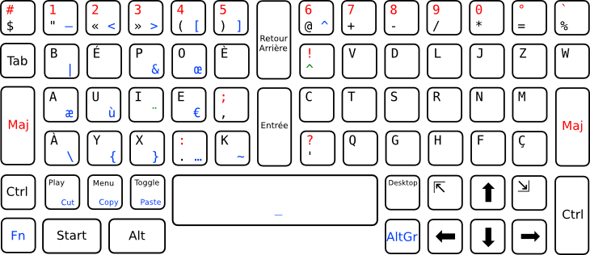

# 06 — Dispositions Clavier

> **Retour à l'index :** [Documentation](./README.md)

---

## Table des matières

- [06 — Dispositions Clavier](#06--dispositions-clavier)
  - [Table des matières](#table-des-matières)
  - [Vue d'ensemble des layouts supportés](#vue-densemble-des-layouts-supportés)
  - [Layout QWERTY](#layout-qwerty)
  - [Layout Bépo](#layout-bépo)
    - [Principes ergonomiques du Bépo](#principes-ergonomiques-du-bépo)
    - [Image de référence — TypeMatrix 2030 Bépo](#image-de-référence--typematrix-2030-bépo)
    - [Ressources](#ressources)
  - [Layout Dvorak](#layout-dvorak)
    - [Rangée de repos Dvorak](#rangée-de-repos-dvorak)
    - [Comparaison QWERTY vs Dvorak vs Bépo](#comparaison-qwerty-vs-dvorak-vs-bépo)
  - [Layout Colemak-DH](#layout-colemak-dh)
    - [Ressources Colemak-DH](#ressources-colemak-dh)
  - [Outils logiciels par système d'exploitation](#outils-logiciels-par-système-dexploitation)
    - [Sous Windows](#sous-windows)
    - [Sous macOS](#sous-macos)
    - [Sous Linux](#sous-linux)
    - [Multiplateforme / Web](#multiplateforme--web)
  - [Outils de conception du layout physique](#outils-de-conception-du-layout-physique)
    - [Keyboard Layout Editor (KLE)](#keyboard-layout-editor-kle)
    - [Ergogen](#ergogen)
    - [Tableau récapitulatif — Outils et usages](#tableau-récapitulatif--outils-et-usages)
  - [Ressources communautaires](#ressources-communautaires)

---

## Vue d'ensemble des layouts supportés

L'Open-TPMX2030 supporte nativement **4 layouts** commutables directement depuis le firmware, sans modifier la configuration de l'OS :

```
┌─────────────┐   ┌─────────────┐   ┌─────────────┐   ┌─────────────┐
│   QWERTY    │   │    Bépo     │   │   Dvorak    │   │ Colemak-DH  │
│  (Standard) │   │ (Français)  │   │  (Anglais)  │   │  (Moderne)  │
│    LED OFF  │   │   LED OFF   │   │  LED Dvorak │   │   LED OFF   │
└─────────────┘   └─────────────┘   └─────────────┘   └─────────────┘
```

La LED **Dvorak** (GP6) s'allume uniquement en mode Dvorak. Les autres layouts ne modifient pas les LEDs d'état (la commutation est visible uniquement via le comportement des touches).

> Pour la commutation entre layouts, voir : [04 — Architecture Firmware](./04-firmware-architecture.md#gestion-des-layouts-alternatifs)

---

## Layout QWERTY

Le **QWERTY** est le layout standard international, utilisé par défaut sur la quasi-totalité des claviers commerciaux. Il sert de référence de compatibilité universelle.

| Caractéristique     | Valeur                                                   |
| ------------------- | -------------------------------------------------------- |
| **Usage**           | Standard international                                   |
| **Idéal pour**      | Compatibilité maximale, logiciels avec raccourcis QWERTY |
| **LED indicatrice** | Aucune (état par défaut)                                 |

**Disposition de référence du TypeMatrix QWERTY :**

```
[ Esc][ 1 ][ 2 ][ 3 ][ 4 ][ 5 ][Bksp][ 6 ][ 7 ][ 8 ][ 9 ][ 0 ][ - ]
[ Tab][ Q ][ W ][ E ][ R ][ T ][Del ][ Y ][ U ][ I ][ O ][ P ][ \ ]
[Caps][ A ][ S ][ D ][ F ][ G ][↵   ][ H ][ J ][ K ][ L ][ ; ][ ' ]
[Shft][ Z ][ X ][ C ][ V ][ B ][     ][ N ][ M ][ , ][ . ][ / ][Shft]
```

---

## Layout Bépo

Le **Bépo** est une disposition de clavier française ergonomique, conçue pour optimiser la frappe en langue française. C'est l'équivalent francophone du Dvorak.

| Caractéristique     | Valeur                           |
| ------------------- | -------------------------------- |
| **Usage**           | Frappe en français, ergonomie    |
| **Créateur**        | Projet communautaire (2008)      |
| **Idéal pour**      | Rédaction française intensive    |
| **LED indicatrice** | Aucune (si configuré par défaut) |
| **Référence**       | [bepo.fr](https://bepo.fr)       |

### Principes ergonomiques du Bépo

- Les **lettres les plus fréquentes** du français (e, s, a, r, t, n, i, u) sont placées sur la **rangée de repos** (home row).
- Les touches **rares** sont repoussées vers les bords.
- Les caractères accentués (é, è, à, ù, ç) sont directement accessibles.

### Image de référence — TypeMatrix 2030 Bépo




### Ressources

- 📖 [Wiki Bépo — TypeMatrix](https://bepo.fr/wiki/TypeMatrix)
- 📖 [Documentation numérique.gouv.fr — Bépo](https://docs.numerique.gouv.fr/docs/51d17aac-0f69-47e5-ac53-45f855d158d7/)
- 🌐 [Forum Bépo — Projet TypeMatrix Mécanique](https://forum.bepo.fr/d/1232-conception-clavier-typematrix-mechanique-version-2)

---

## Layout Dvorak

La **disposition Dvorak** (inventée par August Dvorak en 1936) redistribue les touches pour placer les lettres les plus fréquentes (en anglais) sur la rangée de repos.

| Caractéristique     | Valeur                                                                 |
| ------------------- | ---------------------------------------------------------------------- |
| **Usage**           | Frappe en anglais, ergonomie                                           |
| **LED indicatrice** | **LED 4 (Dvorak) allumée**                                             |
| **Référence**       | [Wikipedia — Dvorak](https://fr.wikipedia.org/wiki/Disposition_Dvorak) |

### Rangée de repos Dvorak

```
QWERTY  :  A  S  D  F  G  H  J  K  L  ;  '
Dvorak  :  A  O  E  U  I  D  H  T  N  S  -
```

### Comparaison QWERTY vs Dvorak vs Bépo

| Critère                      | QWERTY         | Dvorak  | Bépo     |
| ---------------------------- | -------------- | ------- | -------- |
| **Langue optimisée**         | — (historique) | Anglais | Français |
| **Déplacement des doigts**   | Élevé          | Réduit  | Réduit   |
| **Apprentissage**            | Standard       | ~100h   | ~100h    |
| **Accessibilité accents FR** | ⚠️ AltGr requis | ⚠️       | ✅ Direct |

---

## Layout Colemak-DH

Le **Colemak-DH** (variante DH = "Mod-DH" de Colemak) est un layout moderne optimisé pour minimiser les mouvements latéraux des index. Il représente une évolution du Colemak original, réduisant le recours aux touches centrales peu ergonomiques (touches B, Y en QWERTY).

| Caractéristique            | Valeur                                                      |
| -------------------------- | ----------------------------------------------------------- |
| **Usage**                  | Frappe anglaise/multilingue à haute performance             |
| **LED indicatrice**        | Aucune                                                      |
| **Référence**              | [DreymaR EPKL](https://github.com/DreymaR/BigBagKbdTrixPKL) |
| **Compatibilité firmware** | Via les fichiers EPKL                                       |

### Ressources Colemak-DH

- 🌐 [Site DreymaR — Colemak Big Bag](https://dreymar.colemak.org/)
- 📦 [GitHub — BigBagKbdTrixPKL](https://github.com/DreymaR/BigBagKbdTrixPKL)
- 📄 [Fichier de configuration EPKL](https://github.com/DreymaR/BigBagKbdTrixPKL/blob/main/EPKL_Layouts_Default.ini)

---

## Outils logiciels par système d'exploitation

Ces outils permettent de modifier la disposition logique des touches **au niveau de l'OS**, indépendamment du firmware du clavier. Utiles pour tester un layout avant de l'intégrer dans le firmware.

### Sous Windows

| Outil               | Description                                                                                 | Lien                                                                               |
| ------------------- | ------------------------------------------------------------------------------------------- | ---------------------------------------------------------------------------------- |
| **Microsoft MSKLC** | Outil officiel pour créer/modifier des layouts (.KLC) — définit chaque touche, Shift, AltGr | [microsoft.com](https://www.microsoft.com/en-us/download/details.aspx?id=102134)   |
| **AutoHotkey**      | Scripts pour remapper des touches ou créer des macros — idéal pour tester rapidement        | [autohotkey.com](https://www.autohotkey.com/)                                      |
| **WinCompose**      | Ajoute une touche "Compose" pour les caractères spéciaux                                    | [github.com/samhocevar/wincompose](https://github.com/samhocevar/wincompose)       |
| **EPKL (DreymaR)**  | Implémentation Windows de Colemak-DH et variantes                                           | [github.com/DreymaR/BigBagKbdTrixPKL](https://github.com/DreymaR/BigBagKbdTrixPKL) |

### Sous macOS

| Outil                  | Description                                                              | Lien                                                                |
| ---------------------- | ------------------------------------------------------------------------ | ------------------------------------------------------------------- |
| **Karabiner-Elements** | Remapping de touches, couches personnalisées, comportement en temps réel | [karabiner-elements.pqrs.org](https://karabiner-elements.pqrs.org/) |

### Sous Linux

| Outil        | Description                                                                                                     | Lien                                                                         |
| ------------ | --------------------------------------------------------------------------------------------------------------- | ---------------------------------------------------------------------------- |
| **XKB**      | Système natif de configuration clavier (X Window). Technique mais très flexible                                 | [Arch Linux Wiki XKB](https://wiki.archlinux.org/title/X_keyboard_extension) |
| **Kalamine** | Outil moderne et convivial pour créer des layouts multiplateforme (Windows, macOS, Linux) — utilisé pour Ergo-L | [github.com/nicowillis/kalamine](https://github.com/nicowillis/kalamine)     |
| **xcape**    | Permet à une touche modificatrice seule d'émettre un caractère différent                                        | —                                                                            |
| **xdotool**  | Simulation d'appuis clavier/souris — utile pour les tests                                                       | —                                                                            |
| **xev**      | Affiche les événements X11 d'un clavier — utile pour déboguer                                                   | —                                                                            |

### Multiplateforme / Web

| Outil                | Description                                                       | Lien                                        |
| -------------------- | ----------------------------------------------------------------- | ------------------------------------------- |
| **Keyman Developer** | Création de layouts pour Windows, macOS, Linux, iOS, Android, Web | [keyman.com](https://keyman.com/developer/) |

---

## Outils de conception du layout physique

Ces outils permettent de **concevoir visuellement la disposition physique** des touches avant de créer le PCB.

### Keyboard Layout Editor (KLE)

[**Keyboard Layout Editor**](http://www.keyboard-layout-editor.com/) est l'outil en ligne de référence pour dessiner la disposition physique des touches :

- Visualisation en temps réel
- Choix des tailles, formes, couleurs
- Export JSON pour Ergogen/KiCad

### Ergogen

[**Ergogen**](https://ergogen.xyz/new) est un générateur de PCB ergonomique basé sur un fichier de configuration YAML. Il est particulièrement adapté aux claviers ortholinéaires comme le TypeMatrix.

```yaml
# Exemple de configuration Ergogen (extrait)
points:
  zones:
    matrix:
      columns:
        outer: { key: { col_net: C0 } }
        pinky: { key: { col_net: C1 } }
        ring:  { key: { col_net: C2 } }
        # ...
      rows:
        bottom: { row_net: R0 }
        home:   { row_net: R1 }
        top:    { row_net: R2 }
```

### Tableau récapitulatif — Outils et usages

| Objectif                         | Outil recommandé       |
| -------------------------------- | ---------------------- |
| Disposition logicielle (Windows) | MSKLC, AutoHotkey      |
| Disposition logicielle (macOS)   | Karabiner-Elements     |
| Disposition logicielle (Linux)   | Kalamine, XKB          |
| Disposition multiplateforme      | Keyman Developer       |
| Conception physique du layout    | Keyboard Layout Editor |
| Génération PCB automatisée       | Ergogen                |
| Firmware clavier standard        | QMK, ZMK               |
| Firmware sur-mesure (ce projet)  | Arduino-Pico           |
| Microcontrôleur                  | RP2040-Zero            |
| Conception PCB                   | KiCad                  |

---

## Ressources communautaires

| Ressource                                                                   | Description                                                   |
| --------------------------------------------------------------------------- | ------------------------------------------------------------- |
| [awesome-keyboard (GitHub)](https://github.com/Delapouite/awesome-keyboard) | Liste curated d'outils, firmwares, guides et projets claviers |
| [r/MechanicalKeyboards](https://reddit.com/r/MechanicalKeyboards)           | Communauté Reddit — retours d'expérience, DIY, layouts        |
| [forum Bépo](https://forum.bepo.fr)                                         | Forum francophone sur les layouts ergonomiques                |
| [keeb.io](https://keeb.io/collections/keyboards)                            | Boutique et ressources pour claviers DIY                      |
| [CMKB — Communauté Colemak](https://colemak.com/)                           | Ressources et tutoriels Colemak                               |

---

> **Page précédente :** [05 — Analyse GPIO & Extension I2C](./05-analyse-gpio-extension.md)  
> **Page suivante :** [07 — Ressources & Références](./07-ressources-references.md)
