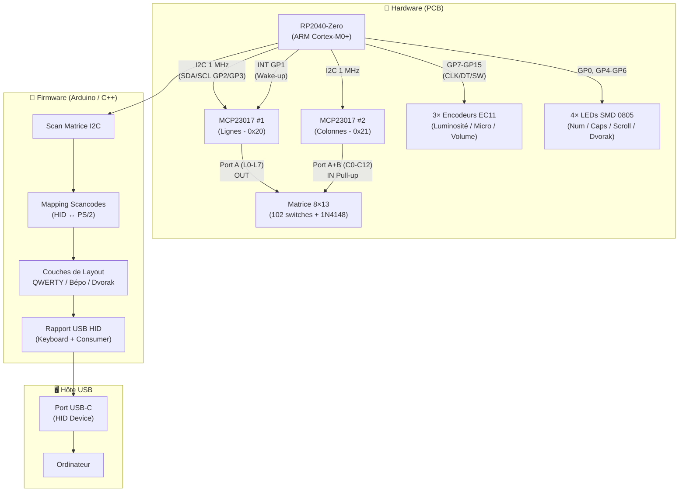
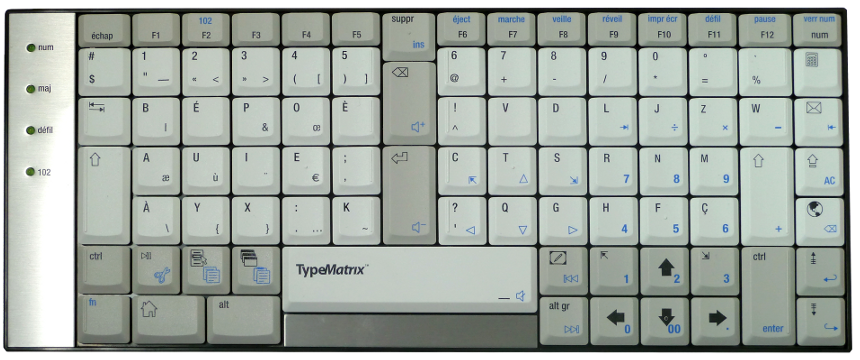

# Documentation Technique — Open-TPMX2030

> Étude technique du projet de conception du clavier **Open-TPMX2030**  
> *(Open Source TypeMatrix Mechanical Edition)*  
> Projet du FabLab **Artilect** — Toulouse

---

## Table des matières

| N°  | Document                                                       | Description                               |
| --- | -------------------------------------------------------------- | ----------------------------------------- |
| —   | [Présentation du projet](./01-presentation-projet.md)          | Genèse, objectifs, organisation du dépôt  |
| —   | [Conception Hardware & PCB](./02-conception-hardware.md)       | MCU, matrice de touches, BOM, pinout      |
| —   | [Interface Homme-Machine (IHM)](./03-interface-ihm.md)         | Encodeurs rotatifs, LEDs, keycaps         |
| —   | [Architecture Firmware](./04-firmware-architecture.md)         | Code C++/Arduino, HID, scancodes          |
| —   | [Analyse GPIO & Extension I2C](./05-analyse-gpio-extension.md) | MCP23017 vs 74HC165, architecture retenue |
| —   | [Dispositions Clavier](./06-dispositions-clavier.md)           | Bépo, Dvorak, QWERTY, outils logiciels    |
| —   | [Ressources & Références](./07-ressources-references.md)       | Datasheets, liens, fournisseurs, projets  |

---

## Architecture Globale du Projet

---

## Résumé Technique Rapide

| Caractéristique          | Valeur                                           |
| ------------------------ | ------------------------------------------------ |
| **Microcontrôleur**      | Waveshare RP2040-Zero (ARM Cortex-M0+ @ 133 MHz) |
| **Nombre de touches**    | 102 touches (layout 102 Europe)                  |
| **Extension GPIO**       | 2× MCP23017 sur bus I2C @ 1 MHz                  |
| **Latence scan matrice** | < 300 µs (invisible à la frappe)                 |
| **Switches V1**          | Cherry MX2A Brown (Tactile)                      |
| **Switches V2**          | Cherry MX2A Blue (Clicky)                        |
| **Anti-ghosting**        | Full N-Key Rollover (NKRO) via diodes 1N4148     |
| **IHM**                  | 3 encodeurs EC11 + 4 LEDs d'état                 |
| **Firmware**             | Arduino-Pico (Earle F. Philhower)                |
| **Interface USB**        | USB HID natif (Keyboard + Consumer Control)      |
| **Layouts supportés**    | QWERTY, Bépo, Dvorak, Colemak-DH                 |
| **Licence**              | Apache-2.0 license (Open Source)                 |

---

## Image de référence du Layout

---

## Liens Rapides

- 🏠 [Dépôt GitHub principal](https://github.com/Artilect-FabTronic/open-tpmx2030-keyboard)
- 📋 [Wiki Bépo — TypeMatrix](https://bepo.fr/wiki/TypeMatrix)
- 🔌 [Datasheet RP2040](https://pip-assets.raspberrypi.com/categories/814-rp2040/documents/RP-008371-DS-1-rp2040-datasheet.pdf)
- 🔌 [Datasheet MCP23017](https://ww1.microchip.com/downloads/aemDocuments/documents/APID/ProductDocuments/DataSheets/MCP23017-MCP23S17-16-Bit-IO-Expander-with-Serial-Interface-DS20001952.pdf)
- 🛠️ [KiCad — Logiciel PCB](https://www.kicad.org/)
- ⌨️ [Configurateur Keycaps ThockFactory](https://thockfactory.com/fr/configurator)
